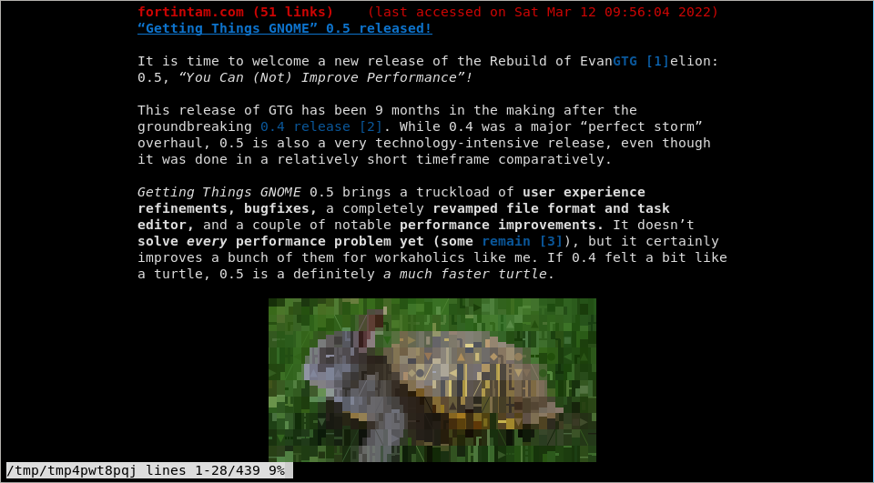
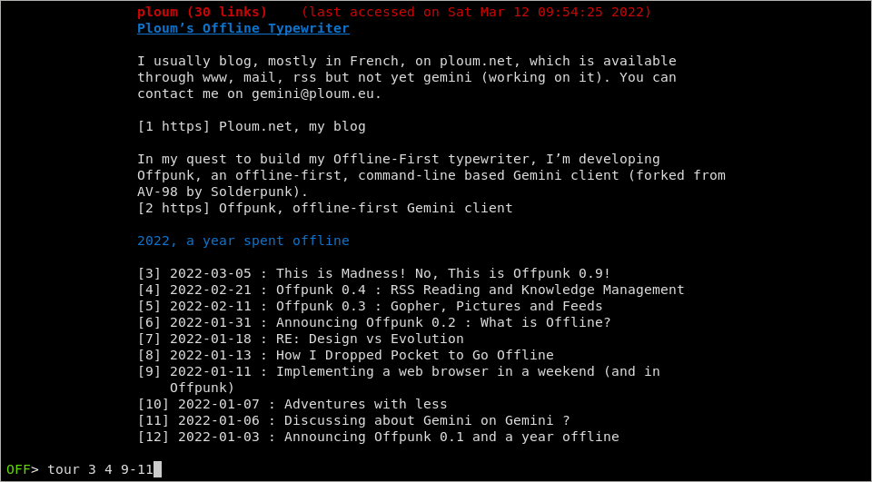

# OFFPUNK

A command-line and offline-first smolnet browser/feed reader for Gemini, Gopher, Spartan and Web by [Ploum](https://ploum.net).

The goal of Offpunk is to be able to synchronise your content once (a day, a week, a month) and then browse/organise it while staying disconnected.

Official project page (repository/mailing lists) : https://sr.ht/~lioploum/offpunk/

Offpunk is a fork of the original [AV-98](https://tildegit.org/solderpunk/AV-98) by Solderpunk and was originally called AV-98-offline as an experimental branch.

## How to use

Offpunk is a single python file. Installation is optional, you can simply download and run "./offpunk.py" or "python3 offpunk.py" in a terminal.

You use the `go` command to visit a URL, e.g. `go gemini.circumlunar.space`. (gemini:// is assumed if no protocol is specified. Supported protocols are gemini, gopher, finger, http, https, mailto, spartan and file).

Links in pages are assigned numerical indices.  Just type an index to follow that link. If page is too long to fit on your screen, the content is displayed in the less pager (by default). Type `q` to quit and go back to Offpunk prompt. Type `view` or `v` to display it again. (`view full` or `v full` allows to see the full html page instead of the article view. `v feed` try to display the linked RSS feed and `v feeds` displays a list of available feeds. This only applies to html pages)

Use `add` to add a capsule to your bookmarks and `bookmarks` or `bm` to show your bookmarks (you can create multiple bookmarks lists, edit and remove them. See the `list` manual with `help list`).

Use `offline` to only browse cached content and `online` to go back online. While offline, the `reload` command will force a re-fetch during the next synchronisation.

Use the `help` command to learn about additional commands. Some abreviations are available. See `abbrevs`.

When launched with the "--sync" option, offpunk will run non-interactively and fetch content from your bookmarks, lists and ressources tentatively accessed while offline. New content found in your subscriptions (see `help subscribe`) will be automatically added to your tour (use `tour ls` to see your current tour, `tour` without argument to access the next item and `tour X` where X is a link number to add the content of a link to your tour).

With "--sync", one could specify a "--cache validity" in seconds. This option will not refresh content if a cache exists and is less than the specified amount of seconds old.

For example, running

`offpunk --sync --cache-validity 43200`

will refresh your bookmarks if those are at least 12h old. If cache-validity is not set or set to 0, any cache is considered good and only content never cached before will be fetched. `--assume-yes` will automatically accept SSL certificates with errors instead of refusing them.

Offpunk can also be configured as a browser by other tool. If you want to use offpunk directly with a given URL, simply type:

`offpunk URL`

To have offpunk fetch the URL at next sync and close immediately, run:

`offpunk --fetch-later URL`

## More

Important news and releases will be announced on the offpunk-devel mailing list 
=> https://lists.sr.ht/~lioploum/offpunk-devel

Questions can be asked on the users mailing list:
=> https://lists.sr.ht/~lioploum/offpunk-users

## Dependencies

Offpunk has no "strict dependencies", i.e. it should run and work without anything
else beyond the Python standard library and the "less" pager.  However, it will "opportunistically
import" a few other libraries if they are available to offer an improved
experience or some other features. Python libraries requests, bs4 and readability are required for http/html support. Images are displayed if chafa or timg are presents (python-pil is needed for chafa version before 1.10). When displaying only a picture (not inline), rendering will be pixel perfect in compatible terminals (such as Kitty) if chafa is at least version 1.8 or if timg is used.

To avoid using unstable or too recent libraries, the rule of thumb is that a library should be packaged in Debian/Ubuntu. Keep in mind that Offpunk is mainly tested will all libraries installed. If you encounter a crash without one optional dependencies, please report it. Patches and contributions to remove dependencies or support alternatives are highly appreciated.

* PIP: [requirements file to install dependencies with pip](requirements.txt)
* Ubuntu/Debian: [command to install dependencies  on Ubuntu/Debian without pip](ubuntu_dependencies.txt)
* Arch: [AUR package for Arch Linux, maintained by kseistrup](https://aur.archlinux.org/packages/offpunk-git)
* [Nix](https://nixos.org/): [package](https://github.com/NixOS/nixpkgs/blob/master/pkgs/applications/networking/browsers/offpunk/default.nix), maintained by [DamienCassou](https://github.com/DamienCassou)
* Alpine Linux: [package maintained by mio](https://pkgs.alpinelinux.org/packages?name=offpunk)
* Please contribute packages for other systems, there’s a [mailing-list dedicated to packaging](https://lists.sr.ht/~lioploum/offpunk-packagers).

Run command `version` in offpunk to see if you are missing some dependencies.

Mandatory or highly recommended (packagers should probably make those mandatory):
* [less](http://www.greenwoodsoftware.com/less/): mandatory but is probably already on your system
* [file](https://www.darwinsys.com/file/) is used to get the MIME type of cached objects. Should already be on your system.
* [xdg-utils](https://www.freedesktop.org/wiki/Software/xdg-utils/) provides xdg-open which is highly recommended to open files without a renderer or a handler. It is also used for mailto: command.
* The [cryptography library](https://pypi.org/project/cryptography/) will provide a better and slightly more secure experience when using the default TOFU certificate validation mode and is recommended (apt-get install python3-cryptography).

Dependencies to enable web browsing (packagers may put those in an offpunk-web meta-package but it is recommended to have it for a better offpunk experience)
* [Python-requests](http://python-requests.org) is needed to handle http/https requests natively (apt-get install python3-requests). Without it, http links will be opened in an external browser
* [BeautifulSoup4](https://www.crummy.com/software/BeautifulSoup) and [Readability](https://github.com/buriy/python-readability) are both needed to render HTML. Without them, HTML will not be rendered or be sent to an external parser like Lynx. (apt-get install python3-bs4 python3-readability or pip3 install readability-lxml)
* [Python-feedparser](https://github.com/kurtmckee/feedparser) will allow parsing of RSS/Atom feeds and thus subscriptions to them. (apt-get install python3-feedparser)
* [Chafa](https://hpjansson.org/chafa/) allows to display pictures in your console. Install it and browse to an HTML page with picture to see the magic.
* [Timg](https://github.com/hzeller/timg) is a slower alternative to chafa for inline images. But it has better rendering when displaying only the image. Install both to get the best of both world but if you need to choose one, choose Chafa. 
* [Python-pil](http://python-pillow.github.io/) is required to only display the first frame of animated gif with chafa if chafa version is lower than 1.10. 

Nice to have (packagers should may make those optional):
* [Xsel](http://www.vergenet.net/~conrad/software/xsel/) allows to `go` to the URL copied in the clipboard without having to paste it (both X and traditional clipboards are supported). Also needed to use the `copy` command. (apt-get install xsel)
* [Python-setproctitle](https://github.com/dvarrazzo/py-setproctitle) will change the process name from "python" to "offpunk". Useful to kill it without killing every python service.

## Features

* Browse https/gemini/gopher/spartan without leaving your keyboard and without distractions
* Built-in documentation: type `help` to get the list of command or a specific help about a command.
* Offline mode to browse cached content without a connection. Requested elements are automatically fetched during the next synchronization and are added to your tour.
* HTML pages are prettified to focus on content. Read without being disturbed or see the full page with `view full`.
* RSS/Atom feeds are automatically discovered by `subscribe` and rendered as gemlogs. They can be explored with `view feed` and `view feeds`.
* Support "subscriptions" to a page. New content seen in subscribed pages are automatically added to your next tour.
* Complex bookmarks management through multiple lists, built-in edition, subscribing/freezing lists and archiving content.
* Advanced navigation tools like `tour` and `mark` (as per VF-1). Unlike AV-98, tour is saved on disk accross sessions. 
* Ability to specify external handler programs for different MIME types (use `handler`)
* Enhanced privacy with `redirect` which allows to block a http domain or to redirect all request to a privacy friendly frontent (such as nitter for twitter).
* Non-interactive cache-building with configurable depth through the --sync command. The cache can easily be used by other software. 
* IPv6 support
* Supports any character encoding recognised by Python
* Cryptography : TOFU or CA server certificate validation
* Cryptography : Extensive client certificate support if an `openssl` binary is available

## RC files

You can use an RC file to automatically run any sequence of valid Offpunk
commands upon start up.  This can be used to make settings controlled with the
`set` or `handler` commanders persistent.  You can also put a `go` command in
your RC file to visit a "homepage" automatically on startup, or to pre-prepare
a `tour` of your favourite Gemini sites or `offline` to go offline by default.

The RC file should be called `offpunkrc` and goes in $XDG_CONFIG_DIR/offpunk (or .config/offpunk or .offpunk if xdg not available). In that file, simply write one command per line, just like you would type them in offpunk. 

## Cache design

The offline content is stored in ~/.cache/offpunk/ as plain .gmi/.html files. The structure of the Gemini-space is tentatively recreated. One key element of the design is to avoid any database. The cache can thus be modified by hand, content can be removed, used or added by software other than offpunk.

There’s no feature to automatically trim the cache. But part of the cache can safely be removed manually.

